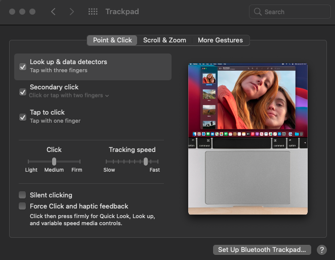

# Xiaomi Notebook 14 Hackintosh


[](https://www.mi.com/in/mi-notebook-14-horizon/)
[](LICENSE)
[](https://github.com/uttusharma/Xiaomi-Notebook14-Hackintosh/releases)

## Introduction

This repo contains information for getting macOS working on a **Xiaomi Notebook 14 Horizon Edition** laptop.

This is intended to create a "fully" functional (as far as possible) hackintosh for the Xiaomi Notebook 14.
If you would like to get started with creating a hackintosh on your laptop but have non experience, I would highly recommend following [**Dortania's OpenCore Install guide**](https://dortania.github.io/OpenCore-Install-Guide/) and then returning here for troubleshooting.
With each new release of macOS we need to resolve each new "minor issue" we run into. The installation is not perfect yet since it's a continuos work-in-progress, but I'm glad to say that **I learned a lot** in the meantime. All of the steps I made to get to this point were a result of countless hours of reading along with trial and error. I am by no means an expert so any help to get this project functional is very appreciated!

 If internet is not working at installation then create [offline installer](https://github.com/doesprintfwork/All-in-one-Vanilla-AMD-Hackintosh-Guide/blob/master/offline-installer-guide/offline-part-2/windows.md).

 For privacy reasons, all SMBIOS information has been wiped out in the configuration file `EFI/OC/config.plist`. [Generate your own SMBIOS Information](#generate-your-own-smbios-information)

 You can follow this guide to install MacOS In your Mi Notebook 14 [YouTude Guide For Installing](https://youtu.be/4LgyTZQ3jfQ)

 This repository is for personal/educational purposes

## Table of contents

- [Xiaomi Notebook 14 Hackintosh](#xiaomi-notebook-14-hackintosh)
  - [Introduction](#introduction)
  - [Table of contents](#table-of-contents)
  - [System Configuration](#system-configuration)
  - [Current Status](#current-status)
  - [Generate your own SMBIOS Information](#generate-your-own-smbios-information)
  - [Improvements/Post-Install](#improvementspost-install)
  - [FAQ](#faq)
    - [My touchpad isn't working after update.](#my-touchpad-isnt-working-after-update)
    - [I can't click to drag files using the trackpad](#i-cant-click-to-drag-files-using-the-trackpad)
    - [My screen turns to black and has no response during the updating process](#my-screen-turns-to-black-and-has-no-response-during-the-updating-process)
  - [Update tracker](#update-tracker)
  - [Changelog](#changelog)
  - [Credits](#credits)

## System Configuration

| Specifications | Detail                                              |
| -------------- | --------------------------------------------------- |
| Computer model | Xiaomi Notebook 14 Horizon Edition 2020 (MX350/GTX) |
| Processor      | Intel Core i3-10110U/ i5-10210U/ i7-10510U          |
| Memory         | 8GB/16GB Samsung DDR4 2400MHz                       |
| Hard Disk      | Samsung NVMe SSD Controller                         |
| Graphics       | Intel UHD Graphics 10th Gen, NVIDIA MX350           |
| Monitor        | BOE NV156FHM-N61 FHD 1920x1080 (15.6 inch)          |
| Sound Card     | Realtek ALC256                                      |
| Wireless Card  | Intel Wireless 9560                                 |
| Touchpad       | I2C ELAN2304                                        |

## Current Status

| Components\OS     | BigSur | Monterey 12.0.1 |
| ----------------- | :----: | :-----------: |
| Touchpad/Gestures |   ✅    |       ✅       |
| Keyboard          |   ✅    |       ✅       |
| Audio             |   🟢    |       🟢       |
| Microphone        |   🟢    |       🟢       |
| Wifi              |   ✅    |       ✅       |
| Bluetooth         |   ✅    |       ✅       |
| Sleep/Wake        |   ✅    |       ✅       |
| Power Management  |   ✅    |       ✅       |
| Graphic Acc.      |   ✅    |       ✅       |
| Backlight         |   ✅    |       ✅       |
| Brightness Key    |   ✅    |       ✅       |
| Hibernation       |   🤷‍♂️    |       ❌       |

```md
✅  : Working out of the box

🟢  : Some additional steps required to make it work

🟡  : Working but not perfectly i.e buggy currently

❌  : Not working currently

🤷‍♂️ : Haven't tested properly yet
```

<details>
<summary>What's not working: incompatible Hardware</summary>

- [ ] **Discrete graphics card** (NVIDIA GeForce MX150) is not working, since macOS doesn't support Optimus technology
  - Have used `SSDT-DDGPU.aml` to disable it in order to save power.
- [ ] **Fingerprint sensor** is not working
  - Fingerprint readers on Macbooks are managed by T2 chip which has not been very throughly reverse engineered yet
    - Have used `SSDT-XHC.aml` to disable it (in order to save some power).

</details>

## Generate your own SMBIOS Information

For privacy reasons, all SMBIOS information has been wiped out in the configuration file `EFI/OC/config.plist`. You need to generate your unique `SMBIOS` info by yourself (recommend to use [**CorpNewt's GenSMBIOS**](https://github.com/corpnewt/GenSMBIOS)), and inject them into your `config.plist`.

- With every **EFI update** you retrieve from [release page](https://github.com/uttusharma/Xiaomi-Notebook14-Hackintosh/releases), please, remember to transfer your Device details under `PlatformInfo -> Generic` in your `config.plist`.

## Improvements/Post-Install

<details>
<summary><strong>Enable Tap (with one finger) for Touchpad</strong></summary>
<br>

Starting from [VoodooI2C v. 2.4.1](https://github.com/VoodooI2C/VoodooI2C/releases), the **click down** action is emulated to **force touch**, which causes the failure of click down and drag gestures.

For example, you can turn off `Force Click` in `System Preferences -> Trackpad` or choose three finger drag in `System Preferences -> Accessibility -> Mouse & Trackpad -> Trackpad Options`

Suggested configuration:


</details>

<details>
<summary><strong>Enable Apple Services</strong></summary>
<br>

Default **SMBIOS** settings of this repo is `MacBookPro16,3` ~~`MacBookPro14,1`~~ ~~`MacBookPro15,2`~~

1. Launch `Terminal` app
2. Copy the following script, paste it into the `Terminal` window, then press `Enter`

   ```bash
   git clone https://github.com/corpnewt/GenSMBIOS && cd GenSMBIOS && ./GenSMBIOS.command 
   ```

3. Type `2`, then press `Enter`
4. Drag your `config.plist` inside the `Terminal` window
5. Type `3`, then press `Enter`
6. Type `MacBookPro16,3`, then press `Enter`

</details>

<details>
    <Summary><strong>Microphone Fix</strong></summary>
<br>

⚠️ Warning combojack will break macOS monterey beta.

Download [Combojack.](https://github.com/hackintosh-stuff/ComboJack)

- Follow given documentation to install combojack.
- Go to system Preferences > Sound > Input and choose Line In as input device.
- Insert headphone, combojack pop-up will appear, select headset from the list.
- If you still face any issue disable ambient noice cancellation.
- you are good to go.

</details>

<details>
    <Summary><strong>MacOS HiDPI</strong></summary>
<br>

⚠️ Warning one-key-hidpi is known to cause [Screen underscaled after sleep](https://github.com/xzhih/one-key-hidpi/issues/33), [HiDPI lag](https://github.com/xzhih/one-key-hidpi/issues/194).

MacOS HiDPI [One-Key-HiDPI REPO](https://github.com/xzhih/one-key-hidpi)
</details>

[Booting MacOS without installer pendrive](https://www.youtube.com/watch?v=qmYEQoFRFH0&list=LL&index=1)
</details>

## FAQ

### My touchpad isn't working after update.

You need to rebuild the kext cache after every system update. Use `Kext Utility.app` or type `sudo kextcache -i /` in `Terminal.app`. Then restart. If this still doesn't work, try to press F9.

### I can't click to drag files using the trackpad

Starts from [VoodooI2C v2.4.1](https://github.com/alexandred/VoodooI2C/releases/tag/2.4.1), the click down action is emulated to force touch, which causes the failure of click down and drag gestures. You can turn off `Force Click` in `SysPref - Trackpad` or choose `three finger drag` in `SysPref - Accessibility - Mouse & Trackpad - Trackpad Options`.

### My screen turns to black and has no response during the updating process

If you have black screen for five minutes and get no response from the device, please force restart your laptop(Long press power button) and choose `Boot macOS Install from ~` entry.- [Xiaomi Notebook 14 Hackintosh]

## Update tracker

| Item                                                                                           | Version    | Remark                                       |
| :--------------------------------------------------------------------------------------------- | :--------- | :------------------------------------------- |
| MacOS                                                                                          | 12.0.1     | Monterey                                     |
| [OpenCore](https://github.com/acidanthera/OpenCorePkg/releases)                                | 0.7.4      | Default Bootloader                           |
| [Lilu](https://github.com/acidanthera/Lilu/releases)                                           | 1.5.6      | Kext/process/framework/library patcher       |
| [WhateverGreen](https://github.com/acidanthera/whatevergreen/releases)                         | 1.5.4      | Handle Graphics card                         |
| [AppleALC](https://github.com/acidanthera/AppleALC/releases)                                   | 1.6.5      | Handle/fix onboard audio                     |
| [CPUFriend](https://github.com/acidanthera/CPUFriend/releases)                                 | 1.2.4      | Power management                             |
| [HibernationFixup](https://github.com/acidanthera/HibernationFixup/releases)                   | 1.4.4      | Handle hibernate status                      |
| [IntelBluetoothFirmware](https://github.com/OpenIntelWireless/IntelBluetoothFirmware/releases) | 2.0.1      | Handle Bluetooth                             |
| [AirportItlwm](https://github.com/OpenIntelWireless/itlwm/releases)                            | 2.0.0 | Handle native Wi-Fi card                     |
| [NullEthernet](https://bitbucket.org/RehabMan/OS-X-Null-Ethernet/downloads/)                   | 1.0.6      | Fake Ethernet card                           |
| [NoTouchID](https://github.com/al3xtjames/NoTouchID/releases)                                  | 1.0.4      | Disable TouchID                              |
| [NVMeFix](https://github.com/acidanthera/NVMeFix/releases)                                     | 1.0.9      | Fix for NVMe SSDs                            |
| [RestrictEvents](https://github.com/acidanthera/RestrictEvents/releases)                       | 1.0.1      | Block unwanted processes                     |
| [VoodooI2C](https://github.com/alexandred/VoodooI2C/releases)                                  | 2.5.6      | Handle I2C device                            |
| [VoodooI2CHID](https://github.com/alexandred/VoodooI2C/releases)                               | 2.5.6      | Touchpad I2C satellite                       |
| [VoodooPS2Controller](https://github.com/acidanthera/VoodooPS2/releases)                       | 2.2.6      | Enable keyboard, alternative trackpad driver |
| [VirtualSMC + plugins](https://github.com/acidanthera/VirtualSMC/releases)                     | 1.2.7      | SMC chip emulation                           |
| [USBInjectAll](https://github.com/daliansky/OS-X-USB-Inject-All/releases)                      | 0.7.6      | Inject USB ports                             |

## Changelog

You can view [Changelog](Changelog.md) for detailed information.

## Credits

- **Special Thanks to [daliansky](https://github.com/daliansky) for providing [XiaoMi-Pro-Hackintosh](<https://github.com/daliansky/XiaoMi-Pro-Hackintosh>)**.
- Thanks to [profzei](https://github.com/profzei/Matebook-X-Pro-2018/).
- Thanks to [itsabhishekolkha](https://github.com/itsabhishekolkha/Mi-notebook-14-Hackintosh).
- Thanks to [Acidanthera](https://github.com/acidanthera) for providing [AppleALC](https://github.com/acidanthera/AppleALC), [AppleSupportPkg](https://github.com/acidanthera/AppleSupportPkg), [HibernationFixup](https://github.com/acidanthera/HibernationFixup), [Lilu](https://github.com/acidanthera/Lilu), [NVMeFix](https://github.com/acidanthera/NVMeFix), [OcBinaryData](https://github.com/acidanthera/OcBinaryData), [OpenCorePkg](https://github.com/acidanthera/OpenCorePkg), [VirtualSMC](https://github.com/acidanthera/VirtualSMC), [VoodooInput](https://github.com/acidanthera/VoodooInput), [VoodooPS2](https://github.com/acidanthera/VoodooPS2), and [WhateverGreen](https://github.com/acidanthera/WhateverGreen).
- Thanks to [apianti](https://sourceforge.net/u/apianti), [blackosx](https://sourceforge.net/u/blackosx), [blusseau](https://sourceforge.net/u/blusseau), [dmazar](https://sourceforge.net/u/dmazar), and [slice2009](https://sourceforge.net/u/slice2009) for providing [Clover](https://github.com/CloverHackyColor/CloverBootloader).
- Thanks to [daliansky](https://github.com/daliansky) for providing [OC-little](https://github.com/daliansky/OC-little).
- Thanks to [hieplpvip](https://github.com/hieplpvip) and [syscl](https://github.com/syscl) for providing sample of DSDT patches.
- Thanks to [OpenIntelWireless](https://github.com/OpenIntelWireless) for providing [IntelBluetoothFirmware](https://github.com/OpenIntelWireless/IntelBluetoothFirmware).
- Thanks to [RehabMan](https://github.com/RehabMan) for providing [EAPD-Codec-Commander](https://github.com/RehabMan/EAPD-Codec-Commander), [EFICheckDisabler](https://github.com/RehabMan/hack-tools/tree/master/kexts/EFICheckDisabler.kext), [OS-X-Clover-Laptop-Config](https://github.com/RehabMan/OS-X-Clover-Laptop-Config), [OS-X-Null-Ethernet](https://github.com/RehabMan/OS-X-Null-Ethernet), and [SATA-unsupported](https://github.com/RehabMan/hack-tools/tree/master/kexts/SATA-unsupported.kext).
- Thanks to [VoodooI2C](https://github.com/VoodooI2C) for providing [VoodooI2C](https://github.com/VoodooI2C/VoodooI2C).
- Thanks to [One-Key-HiDPI](https://github.com/xzhih/one-key-hidpi)
